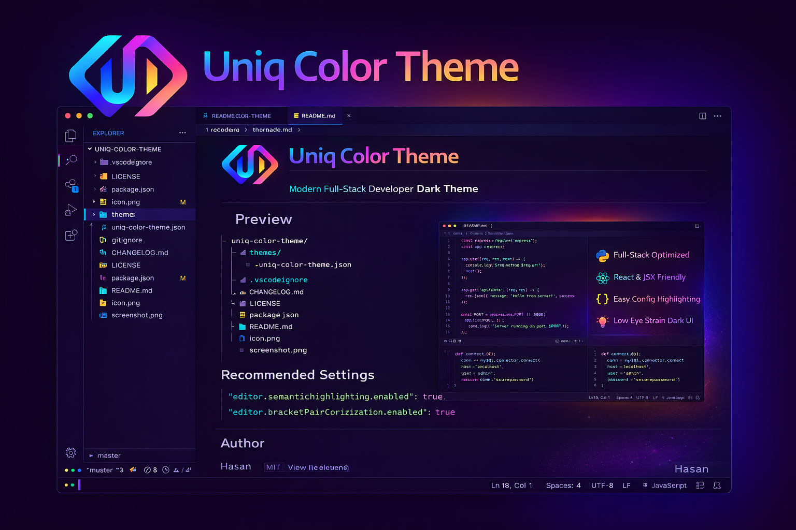

# color-theme-good

A Modern Neon Dark Theme for Developers.

Designed for JavaScript, TypeScript, React, Node.js, Python and more.

---

## ✨ Features

- Deep Dark Background
- Vibrant Neon Keywords
- Clean Sidebar Contrast
- Optimized for Long Coding Sessions
- Semantic Highlighting Enabled
- Terminal Themed

---

## 📸 Preview

---

## 🚀 Installation

### From VS Code Marketplace

1. Open Extensions (Ctrl+Shift+X)
2. Search: color-theme-good
3. Click Install
4. Select theme from:
   Preferences → Color Theme

---

### Manual Install

1. Download `.vsix`
2. Open VS Code
3. Extensions → Install from VSIX
4. Select file

---

## 🛠 Supported Languages

- JavaScript
- TypeScript
- React
- Node.js
- Python
- HTML / CSS
- JSON

---

## 📜 License

MIT License

---

Made with ❤️ for Developers
